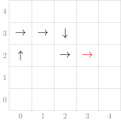
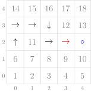

# COMP1100 Assignment 2

In this assignment, you will write code to build the basic rules and gameplay of the 
classic [snake game](https://en.wikipedia.org/wiki/Snake_(video_game_genre)) into 
our provided framework. 

{:.msg-info}  
This assignment is worth 12% of your final grade.

{:.msg-warn}  
**Deadlines**: <br />
Code submission: Tuesday October 5th, at 11pm Canberra time *sharp* <br />
Report submission: Wednesday October 6th, at 11pm Canberra time *sharp*.


## Overview of Tasks

This assignment is marked out of 100 with the following breakdown:

| **Task**                                 | **MARKS**    |
|------------------------------------------|--------------|
| Task 1: Types and Helper Functions       | 25           |
| Task 2: Visualising the Game             | 15           |
| Task 3: Implementing the Game            | 20           |
| Unit Tests                               | 10           |
| Style                                    | 10           |
| Technical Report                         | 20           |

{:.msg-warn}  
From this assignment onward, code that does not compile will be penalised
heavily. To avoid penalisation **both** the commands `cabal v2-run snake`
**and** `cabal v2-test` must run without compilation errors. 
If you have a partial solution that you cannot get working,
you should comment it out and write an additional comment 
directing your tutor's attention to it. If this function is
called by another working function, or if it is provided in the framework,
you should leave it undefined to avoid errors when running the above commands.

## Getting Started

1. First **fork** the assignment repository at
   <https://gitlab.cecs.anu.edu.au/comp1100/comp1100-assignment2>. 
   Then clone your repository to a workspace in VSCodium, following the same steps as in 
   [Lab 2](https://cs.anu.edu.au/courses/comp1100/labs/02/#forking-a-project). Here are the steps once again:
   - Click on the following link to fork the repository:
     <https://gitlab.cecs.anu.edu.au/comp1100/comp1100-assignment2/-/forks/new>.
   - You will be asked where to fork the repository. You should see yourself,
     so select that as the target namespace.
   - Once you successfully fork the project, you will be redirected to
     a new Web page where you will notice **your name** before  
    `> project-name`. This page displays your fork of the repository.
    The URL in your browser should reflect the change:
    <https://gitlab.cecs.anu.edu.au/uXXXXXXX/comp1100-assignment2>

2. Clone your repository:
   - Click the **Clone** button. Copy the Clone with HTTPS link by choosing **Copy to Clipboard**.
   - On your work machine (VDI or personal), launch VSCodium.
   - Open the **Command Palette** by selecting "View > Command
     Palette..." from the menu.
   - In the Command Palette, type `git clone` and press Enter.
   - Paste the remote repository URL that you copied in step 1 into the
     Command Palette and press Enter. Follow the prompts to enter your username and password as needed.
   - Navigate to your `comp1100` working folder and select that as your local repository location.
   - Click **Open**; you should now see the project files.

3. Add **our** version of the repository as a *remote* called `upstream` using the
   following steps. This allows us (course staff) to provide updates to you if they are needed.
   - Go to the Command Palette in VSCodium.
   - Type `git remote`.
   - Click **Git: Add Remote**.
   - Enter `upstream` into the box for the remote name.
   - Use the following URL as the remote:
     `https://gitlab.cecs.anu.edu.au/comp1100/comp1100-assignment2.git`.

## Overview of the Repository

As in assignment 1, your code will split into three main modules: 
`src/Model.hs`, `src/Controller.hs` and `src/View.hs`, although for this assignment
some behind the scenes work (including event handling) is done separatley in `app/Main.hs`.
You do not need to touch this file and only need to consider `src/Model.hs`, `src/Controller.hs`
and `src/View.hs`.
You will also need to implement tests in `src/SnakeTest.hs`, 
which contains some example tests for you to study.

The code in `app/Main.hs` is commented if you wish to read it, but you are
not required to understand it, and you will not need to edit it.

### Other Files

* `src/Testing.hs` is the testing library we used in Assignment 1.
  You should read this file and `src/SnakeTest.hs`, and make sure you
  understand how to write tests. If you are still not sure, you can ask
  on Piazza or in drop-ins.

* `app/Main.hs` launches the test application and contains the bulk of a small
   CodeWorld test program that uses your snake code. We discuss its features in
   "Overview of the Test Program". You are not required to read or understand this
   file to complete the assignment.

* `test/Main.hs` is a small program that runs the tests in `src/SnakeTest.hs`

* `comp1100-assignment2.cabal` tells the cabal build tool how to build your assignment.
  You are not required to understand this file, and we will discuss how to use cabal below.

* `Setup.hs` tells cabal that this is a package with no unusual build steps.
  Some complex packages (that we won't see in this course) need more complex code here.
  You are not required to understand it.

## Overview of Cabal

As before, we are using the `cabal` tool to build the assignment code.
The commands provided are very similar to last time:

* `cabal v2-build`: Compile your assignment.

* `cabal v2-run snake`: Build your assignment (if necessary), and run the test program.

* `cabal v2-repl comp1100-assignment2`: Run the GHCi interpreter over your project.

* `cabal v2-test`: Build and run the tests. This assignment is set up to run a unit test
  suite like in Assignment 1, but you will be writing the tests this time.
  The unit tests will abort on the first failure or call to an `undefined` function.

{:.msg-info}  
You should execute these cabal commands in the **top-level directory** of your project:
`~/comp1100/assignment2` (i.e., the directory you are in when you launch a terminal from VSCodium).


## Overview of the Test Program

The test program in `app/Main.hs`,  
uses CodeWorld, just like Assignment 1.

The test program will be in one of three modes: `Start`, `Debug` or `Play`.
Nothing will happen in the `Start` mode, and the program 
will wait for you to change to `Debug` or `Play`. 

In `Debug` mode, the snake will only move when prompted with `<Spacebar>`.

In the `Play` mode, the snake will automatically move 5 times per second.

The test program responds to the following keys:

| Key          | Effect                                          |
|--------------|-------------------------------------------------|
| `<Up>` / `<Down>` / `<Left>` / `<Right>` Arrows | Where possible, reorients the head of the snake to face the direction of the arrow. Pressing an arrow key in `Start` mode will put the game in `Play` mode. |
| `<Esc>`      | Reset the game to its initial state. |
| `D`          | Switch in or out of `Debug` mode. |
| `<Spacebar>` | When in Debug mode, move the snake forward into its next position. |

The test program also considers time as an event, and when in the `Play` mode,
tries to move the snake forward about 5 times per second. You don't need to worry
about how this works, but it means you can use the test-program like the classic snake game.

{:.msg-warn}  
If you try to use the test program without completing Task 2, or you try to run
the game before completing Task 3, the test program may crash with the following error:

```
"Exception in blank-canvas application:"
Prelude.undefined
```
This means the test program was called on a function you have yet to define.
If this happens when you have finished part 2, refresh the browser to continue.

## Overview of our Snake

Several data types have been defined for you in `src/Model.hs`. 

The first is the `Habitat` data type. You can consider this to be the
current state of the snake game. 

`Habitat` has two constructors, `Habitat` and `GameOver`. 

If the snake is alive and still has room in its `Habitat`,
then we use the `Habitat` constructor, which contains: 

  1. The dimensions of the `Habitat`, of the form `(length, height)`;
  2. A [pseudorandom](https://en.wikipedia.org/wiki/Pseudorandom_number_generator) 
     `Int` that will be changed each time the snake moves. 
     (You don't need to worry about how this works,
     and we won't use it until Task 3).
  3. There is one piece of `Food` in the snake's habitat.
     How that `Food` is defined will be up to you. 
  4. The `Snake` itself. 

If the snake has died by colliding with itself or leaving 
its `Habitat`, or if the snake has consumed all the food 
possible and has filled the entire `Habitat`, then it is
game over. In either of these cases, we use the `GameOver`
constructor, which contains:

  1. The dimensions of the `Habitat`; and 
  2. The result (whether the snake died or filled the whole `Habitat`).

The result, in turn, contains the snake. 

The other data type we will deal with here is the `Snake` data type. 
This data type has only the constructor `Snake`, and holds: 
  
  1. The `Location` of the snake's head;
  2. The `Direction` the `Snake` is facing; and
  3. A list of type `[Direction]` where the element with index 0 (the first 
    element in the list) represents the direction of the snake's head
    relative to it's first body-segment. Then, each subsequent element gives the 
    direction of the previous body segment relative to itself - i.e., it points to the previous
    body segment. 
    
  A visualisation of the `Snake` 

   $$\text{Snake} \hspace{1mm} (3,2) \hspace{1mm} \rightarrow \hspace{1mm} [\rightarrow,\downarrow,\rightarrow,\rightarrow,\uparrow]$$
    
  (where arrows represent `Direction`s) on a `(5,5)` grid is included below:



{:.msg-info}
Note that this is not intended as an example for how to draw the `Snake` in task 2;
it is only to aid your understanding of the `Snake` data type. 

## Task 1: Types and Helper Functions (25 Marks)

### Types: 

Before we can begin implementing the rules for Snake, there are still
two data types left to be defined:

Our snake needs to grow, and so at any time in the `Habitat`,
there is a single piece of food that the snake may eat.
We want our snake's food to stay at a fixed `Location` until 
it is expired: Either eaten by the snake,
or it has been around for too long and gone rotten. 

At present, to allow the framework code to compile, `src/Model.hs` contains
the following type aliases:

```haskell
type Food = ()

type Direction = ()
```

The type `()` can be thought of as the set of empty tuples
and contains only one value, `()`.

These type aliases are included **only** to let the code compile,
and you should delete these lines along with their comments when
you define your own data types. 

Your first task is, in `src/Model.hs`, to define the data type `Food` to keep track of 
where the food is and how long it has left before it rots. 
You may also choose to include a way to keep track of whether the
food has been eaten or has gone rotten (run out of time).

We also need to define our `Direction` type.
The `Direction` type should have one value for each possible
direction of movement, so that we can keep track of only the directions
we need.

Note that our snake will try to change direction only when we press an arrow key,
so the `Direction` type should be in [one-to-one correspondence](https://en.wikipedia.org/wiki/Bijection)
with the arrow keys. 

Your next task is to define the data type `Direction` along with the function
`parseDirection` in `src/Controller.hs` which tries to parse the strings 
`"Up"`, `"Down"`, `"Left"` and `"Right"` into their corresponding `Direction`s,
to allow the framework to use your `Direction` type.

#### Hints: 

  * The `Either a b` sum type has constructors `Left a` and `Right b`,
   and so when defining a new data type, it will not be possible to use these
   as names for your constructors.

  * The framework may call `parseDirection` with an input that is not an arrow 
   key. What would a sensible output be in this case? 

### Helper Functions:

The other functions you need to write for this task are:
 
 * In `src/Model.hs`, 
   `initialFood :: Food`, which is a starting value for food and 
   `initialSnake :: Dimensions -> Snake`, which is a starting value for our
   snake when the game begins. You may assume that the given `Dimensions` will
   have length and height both greater than or equal to 4.
   The `initialSnake` must be valid, in no immediate danger 
   (it won't die by moving one place in any direction)
   and have at least one and no more than three body segment(s) other
   than its head.
   The `Food` cannot be on the same location as any part of the snake,
   and does not necessarily need a starting position at all, depending on your
   definition of the `Food` data type.
   Within these constraints, you may define `initialFood`
   and `InitialSnake` however you like.

  * In `src/Controller.hs`,
   `allCoords :: Dimensions -> [Location]` which, given `Dimensions`, 
   $$(x,y)$$, returns a list of all the `Location`s in the rectangle
   bounded by $$(0,0)$$, $$(0,y-1)$$, $$(x-1,y-1)$$ and $$(x-1 , 0)$$ inclusive.
   The order the locations are returned in is not important.
     - For example, `allCoords (2, 3)` could return
       `[(0,0), (0,1), (0,2), (1,0), (1,1), (1,2)]`, but can be in any order. 
     - This is the list of all valid `Location`s in the `Habitat`
     - None of the `Location`s can be repeated in the output list.
     - This will be an essential helper function in Task 3.

 * In `src/Controller.hs`, `isValidSnake :: Habitat -> Bool` which given a `Habitat` returns whether its
   `Snake` is valid within that `Habitat`. A snake is valid if it:
     - Has at least one body segment other than its head;
     - is not facing its first body segment;
     - never collides with itself (no two body segments are in the same location); and 
     - does not leave its `Habitat`. 
 * You also need to define when the snake should be valid if the game is over.
    - Once you have thoroughly tested this function,
      you may find it useful for testing.
    - Don't worry too much about the `GameOver` case. If you are not sure,
      maybe come back after attempting task 3.

## Task 2: Visualising the Game (15 Marks) 

Your next task in `src/View.hs` is to provide the `habitatToPicture`,
function to visualise the game. Task 2 and task 3 are independent, 
so feel free to move on to task three if you are stuck here.

The background of the game should always be 12 by 12 units.
The `Habitat` will have to scale to fit inside of it. The longest side
of the `Habitat` will take up 12 units in length. For example, if the 
dimension of the `Habitat` was (15,9), then the side of length 15 will
take up 12 units, and the side of length 9 will take up
$$9 \times \frac{12}{15}$$ units. Both the background and the `Habitat` are
centred at the origin. All other components in the `Habitat` 
(e.g. the snake and food) need to scale too.

In `src/View.hs`, define the function `habitatToPicture :: Habitat -> Picture`
which draws the `Habitat` to `CodeWorld`.
 * When the game is not over, this should draw:
      - The drawing of the background with a border. 
      - The drawing of the `Habitat`.
      - The snake's head, along with some way of signifying the direction it is facing.
      - The snake's body (in a different colour to the head), and 
      - The food, which should be a different shape to each part of the snake.
      - All of the different components above should be distinguishable (in colour)

It is up to you how you wish to draw a finished game, but it cannot be blank and must be
different depending on whether the snake died or filled the whole habitat.
You do not need to include any text.

#### Tips:

 * Writing this as a single function could get a bit unwieldy. Consider breaking
 it up into smaller helper functions, one for each of the components. 

 * You can draw everything with reference to their in-game Location to start with,
  and then re-scale and translate everything together at the end.

 * You can use `fromIntegral` if you need to convert `Int`s to `Double`s.

 * Here is a link to the [codeworld documentation](https://hackage.haskell.org/package/codeworld-api-0.5.0/docs/CodeWorld.html) 
  which you may need!
 
 * If you are stuck here, a good first step is to get `habitatToPicture` to 
   work for particular dimensions `(12,12)`. This will be worth partial marks,
   and can also help you get unstuck.
   Additionally, Task 3 does not rely on Task 2 (although you won't be able to 
   run the game in the browser), so you can move on to task 3 without even
   attempting this task!

## Task 3: Running the Game (20 Marks) 

Now you have the basic definitions and a means of visualising the snake game,
it is time to develop the rules to complete the game. 

### Your Tasks

Define the following functions in `src/Controller.hs`:

  * `turn :: Direction -> Snake -> Snake` that turns the snake to face
     the given direction, if possible. 
     The snake cannot turn its head to face its next body segment.
     This function is used by the framework, and you won't need to
     use it elsewhere in your code.


  * `stepHabitat :: Habitat -> Habitat` which, given a `Habitat` 
    moves everything forward by one unit of "time".
    This function is where the `Snake` and `Food` are moved. 

	If the game is over, there is nothing left to step, and so `stepHabitat`
  	does nothing. Otherwise, the first thing this function needs to do is to step (or slither) the snake forward by one unit in the direction the snake is facing.
 
    - If the snake is not valid after it moves, it dies, and the game is over.  
 
    - When the `Snake` moves its head onto to `Location` of its `Food`, 
      that food is now eaten and so expired 
      (as the snake cannot eat it again!). 
      The end of the snake should remain in place as the snake grows.
      If after eating this `Food`, the snake takes up the entire `Habitat`,
      the snake has eaten its fill, and the game is over! Otherwise, a new
      piece of food will need to be placed, as described below. 
 
    - When the `Snake` moves its head to an empty `Location`,
      its last body segment should disappear as it "slithers" forward.  

  * `stepHabitat` also needs to update the `Food`:

    - If the `Food` was to expire in `t` many steps, it should now
      expire in `t-1` many steps.

    - If the `Food` has expired,
      we need to place a new piece of food 
      in a new location that is free -- nowhere covered by the
      (updated) snake, nor its previous position. The game would 
      be a bit boring if the `Food` predictably moved from 
      one location to the next in a set fashion, and so here
      we need to use the pseudorandom `Int` stored in the `Habitat`. 
      Given that this `Int`, $$n$$, is some between `1` and the 
      number of possible new `Location`s the `Food` could move to,
      your task here is to construct this list of possible `Location`s,
      and then select the $$n$$ th element of that list
      to be the new `Location` of the snakes food. 

      - To clarify, a possible location is one that (a) is not the
       food's previous location **and** is not covered by any part
       of the snake. A possible enumeration of points on the example grid 
       (with food included as a blue circle) would be:
       
       
   
      - The number of steps this new `Food` will take to 
       expire should be set to the 
       [Manhatten distance](https://en.wikipedia.org/wiki/Taxicab_geometry) 
       between opposite corners of the grid, i.e., 
        $$\text{length} + \text{height} - 1$$ 
   
      - If there is no possible new `Location` for the food to go,
        the food should remain in the same `Location`. 

### Hints

* Break the problem down into subproblems (separate functions), 
  and test each in isolation. If you find a function that does not
  do what you expect, you will have smaller units of code to debug.
  This modularised code is easier to get your head around.

* If you break `stepHabitat` into separate functions, 
  in which order should they be applied?

* Do the helper functions from Task 1 solve any of your subproblems?

* Higher-order functions can make your code easier to write and read,
  in addition to reducing duplicated code. That said, it is possible
  to complete this assignment without them.

* The (infix) function `!! :: [a] -> Int -> a` (pronounced "bang") 
  returns the element at a given index
  of a given list. Note that the index of the
  first element of a list, `list`, is `0` 
  and the index of the last element is `length list - 1` 

* What should your program do when the `Snake`'s head is directly behind its tail?

* The psuedorandom `Int` in your output `Habitat` can be anything you like - it will
  be automatically changed by the framework before `stepHabitat` is called again.

### Optional Extra:
 
It is up to you whether a snake should die if it runs into a wall or if it
should wrap around to the other side. This latter case is much more complex
though, and not worth any extra marks!
Your `isValidSnake` function must be consistent with your choice here.

## Unit Tests (10 Marks)

How do you know that the program you've written is correct?
GHC's type checker rejects a lot of invalid programs, but you've
written enough Haskell by now to see that a program that compiles
is not necessarily correct. Testing picks up where the type system
leaves off and gives you confidence that changing one part of a program
doesn't break others. You have written simple doctests in your labs,
but larger programs need more tests, so the tests you will write for
this assignment will be labelled and organised in a separate file from
the code.

Open `src/SnakeTest.hs`. This file contains several example test cases,
written using a simple test framework defined in `src/Testing.hs`.
These files are heavily commented for your convenience.

You can run the tests by executing `cabal v2-test`. If it succeeds, it won't print
out every test that ran, but if it fails, you will see the output of the test run.
If you want to see the tests every time, use
`cabal v2-test --test-show-details=streaming` instead.

### Your Task

Replace the example tests with tests of your own. The tests that you write
should show that the Haskell code you've written in Tasks 1-2 is working correctly.

You do not need to (and cannot) write tests for functions that output a picture, 
however you may be able to write testable helper functions in these cases.

Also be aware that you can simulate the game for the most part by repeated calls
to `stepHabitat` and `turn`, but the `Int` in `Habitat` will not change for you,
as it is dependant on behaviour in `app/Main.hs`. Instead, you can use the
`changeInt` function in `src/SnakeTest.hs` to emulate this behaviour.  


#### General Hints

* Try writing tests before you write code. Then work on your code until the tests pass.
  Then define some more tests and repeat. This technique is called *test-driven development*.

* The expected values in your test cases should be easy to check by hand. 
  If the tested code comes up with a different answer, then it's clear that the
  problem is with the tested code and not the test case.

* Sometimes, it is difficult to check an entire structure that's returned
  from one of your functions. Maybe you can compute some feature about your 
  result that's easier to test?

* If you find yourself checking something in GHCi
  (i.e., `cabal v2-repl comp1100-assignment2`), ask yourself 
  "should I make this into a unit test?". The answer is often "yes". 
  This is not because making it a unit test makes the test you are writing
  any better or more rigorous; it is just for the sake of documenting the
  test, so anyone else who looks at your program can be sure it works 
  in that case as well.

* If you are finding it challenging to come up with sensible tests,
  it is possible that your functions are doing too many things at once.
  Try breaking them apart into smaller functions and writing tests for each.

#### Technical Hints

* The `assertEqual` and `assertNotEqual` functions will not work on the CodeWorld
  `Picture` type. Therefore, it is not possible to write tests for `habitatToPicture`.

* If you want to write tests about new types you have defined, add 
 `deriving (Eq, Show)` to the end of the type definition, like this:

  ```haskell
  
     data MyType = A | B | C deriving (Eq, Show)

  ```

* It is not possible to test for a call to `error` using the tools provided in this course.

* Your program should never produce an exception

  - If it does, find the lines that cause it and try to fix it

## Style (10 Marks)

> "[...] programs must be written for people to read, and only
> incidentally for machines to execute."

From the foreword to the first edition of 
[Structure and Interpretation of Computer Programs](https://mitpress.mit.edu/sites/default/files/sicp/full-text/book/book-Z-H-7.html).

Programming is a brain-stretching activity, and you want to make it as
easy on yourself as possible. Part of that is making sure your code is easy
to read because that frees up more of your brain to focus on the more challenging parts.

You should also make sure to resolve any warnings before submission.

Guidance on good Haskell style can be found in 
[this course's Style Guide](https://cs.anu.edu.au/courses/comp1100/resources/04-style/), and in lectures.

### Your Task

Ensure that your code is written in good Haskell style.

## Technical Report (20 Marks)

You should write a concise [technical report](https://cs.anu.edu.au/courses/comp1100/resources/08-reports/).

The **maximum word count** is **1250**. This is a *limit*, not a *quota*: concise presentation is a virtue.

{:.msg-warn}  
Once again: This is not a required word count. They are the 
**maximum number of words** that your marker will read. If you can do it 
in fewer words without compromising the presentation, please do so.

Your report must be in PDF format, located at the root of your assignment
repository on GitLab and named `Report.pdf`. Otherwise, it may not be marked,
or may be marked with a penalty. 

The report must have a **title page** with the following items:

* Your name
* Your laboratory time and tutor
* Your university ID

An excellent report will:

* Demonstrate a conceptual understanding of all major functions and how they 
interact when the program as a whole runs;

* Explain your design process, including your assumptions, and the reasons behind choices you made;

* Discuss how you tested your program, and in particular, why your tests give you
  confidence that your code is correct; and

* Be well-formatted without spelling or grammar errors.


### Content and Structure

Your audience is the tutors and lecturers who are proficient at programming
and understand the concepts taught in this course. You should not, for example,
waste words describing the syntax of Haskell or how recursion works. After
reading your technical report, the reader should thoroughly understand what
problem your program is trying to solve, the reasons behind major design choices,
and how it was tested. Your report should give a broad overview of your program;
however, you should focus on the specifics of what *you* did and why.

Remember that the tutors have access to the above assignment specification,
and if your report *only* contains details from it, you will only receive minimal
marks. Below is a potential outline for the structure of your report and some
things you might discuss in it.

#### Introduction

If you wish to do so, you can write an introduction. In it, give:

* A brief overview of your program:

  - how it works; and
  - what it is designed to do.

#### Content

Talk about why you structured the program the way you did.
Below are some questions you could answer:

* Program design
  - Describe what each relevant function does conceptually. 
    (i.e. how does it get you closer to solving the problems outlined in this assignment spec?)

  - How do these functions piece together to make the finished program?
    Why did you design and implement it this way?

  - What major design choices did *you* make regarding the functions that *you’ve*
    written, and the overall structure of your program?

* Assumptions

  - Describe any assumptions that you needed to make and how they have influenced your design decisions.

  - For example, if you used a function that would crash given the empty list as input, why was that okay?

* Testing

  - How did you test individual functions?

    - Be specific about this - the tutors know that you have tested your program,
      but they want to know *how*, and *why* those 
      tests were useful for your program design.
    - Describe the tests that prove individual functions on their own behave
      as expected (i.e. testing a function with different inputs and doing a
      calculation by hand to check that the outputs are correct).

  - How did you test the entire program? What tests did you perform to show that
    the program behaves as expected in all (even unexpected) cases?

  - Again, be specific - what parts of your program did you need to test,
    and what examples did you choose to test.

  - Remember that testing does not just mean unit tests.
    Even if you did not write any unit tests, 
    you can still have a proper discussion of testing in your report.

* Inspiration / external content

  - What resources did you use when writing your program (e.g., published algorithms)?

  - If you have used resources such as a webpage describing an algorithm,
    be sure to cite
    it properly at the end of your report in a ‘References’ section. 
    References do not count to the maximum word limit.

#### Reflection

Discuss the reasoning behind your decisions,
rather than just *what* the decisions were.
You can reflect on not only the decisions you made but the
process through which you developed the final program:

* Were there any parts of your program that you could have
  done differently? Why did you make those design choices the
  way that you did?

* Did you encounter any conceptual or technical issues?

  - If you solved them, describe the relevant details
    of what happened and how you overcame them.

  - Sometimes limitations on time or technical skills can limit
    how much of the assignment can be completed. If you ran into
    a problem that you could not solve, then your report is the perfect
    place to describe them. Try to include details such as:

    - theories as to what caused the problem;

    - suggestions of things that might have fixed it; and

    - discussion about what you did try, and the results of these attempts.

* What would you have done differently if you were to do it again?

  - What changes to the design and structure you would make if you
    wrote the program again from scratch?

* Are parts of the program confusing for the reader? You can explain
  them in the report (in this situation, you should also make use of comments in your code).

* If you collaborated with others, what was the nature of the collaboration?
  (Note that you are only allowed to collaborate by sharing ideas, not code.)

  - Collaborating is any discussion or work done together on planning or writing your assignment.

* Other info

  - You may like to briefly discuss details of events that were relevant
    to your process of design - strange or interesting things that you
    noticed and fixed along the way.

{:.msg-info}  
This is a list of **suggestions**, not requirements. You should only discuss
items from this list if you have something interesting to write.

### Things to avoid in a technical report

* Line by line explanations of large portions of code. 
 (If you want to include a specific line of code, be sure to 
 format as described in the "Format" section below.)

* Pictures of code or VSCodium.

* Content that is not your own, unless cited.

* Grammatical errors or misspellings. Proofread it before submission.

* Informal language - a technical report is a professional document, and as such should avoid things such as:

  - Unnecessary abbreviations (atm, btw, ps, and so on), 
    emojis, and emoticons; and

  - Recounting events not relevant to the development of the program.

* Irrelevant diagrams, graphs, and charts. Unnecessary elements will
  distract from the important content. Keep it concise and focused.

If you need additional help with report writing,
the [academic skills writing centre](http://www.anu.edu.au/students/academic-skills/appointments/academic-skills-writing-centre) 
has a peer writing service and writing coaches.

### Format

You are not required to follow any specific style guide (such as APA or Harvard).
However, here are some tips which will make your report more pleasant to read and
make more sense to someone with a computer science background.

* Colours should be kept minimal. If you need to
  use colour, make sure it is essential.

* If you are using graphics, make sure they are *vector*
  graphics (that stay sharp even as the reader zooms in on them).
* Any code, including type/function/module names or file names, that
  appears in your document should have a monospaced font (such as Consolas,
  Courier New, Lucida Console, or Monaco)
* Other text should be set in serif fonts (popular choices are Times,
  Sabon, Minion, or Caslon).
* When available, automatic *ligatures* should be activated.
* Do not use underscore to highlight your text.
* Text should be at least 1.5 spaced.

## Communication

**Do not** post your code publicly, either on Piazza or via other forums.
Posts on Piazza trigger emails to all students, so if by mistake you post
your code publicly, others will have access to your code, and you may be
held responsible for plagiarism.

Once again, and we cannot stress this enough: **do not post your code publicly**.
If you need help with your code, post it *privately* to the instructors.

When brainstorming with your friends, **do not share code**. There might be
pressure from your friends, but this is for both your and their benefit.
Anything that smells of plagiarism will be investigated and there
may be serious consequences.

Sharing ideas and sketches is perfectly fine, but sharing should stop at ideas.

Course staff will not look at assignment code unless it is posted **privately** in Piazza.
Or in a private call at an online drop-in.

Course staff will typically assist by asking questions, directing you to relevant
 exercises from the labs, or definitions and examples from the lectures.

{:.msg-info}  
Before the assignment is due, the course staff will not give individual
tips on writing functions for the assignment or improving your code. We will
help you get unstuck by asking questions and pointing you to relevant lectures
and lab material. You will receive feedback on your work when marks are released.


## Submission Advice

Start early, and aim to finish the assignment several days before the due date.
At least 24 hours before the deadline, you should:

* Re-read the specification one final time, and make sure you've
  covered everything.

* Confirm that the latest version of your code has been pushed to GitLab.

* **Ensure your program compiles and runs**,
  including the `cabal v2-test` test suite.

* Proofread and spell-check your report.

* Verify that your report is in PDF format, in the root of the project
  directory (not in `src`), and named `Report.pdf`. That capital `R` is
  important as Linux uses a case-sensitive file system.
  Check that you have successfully added it in GitLab.

* Commit and push your work regularly! Committing and pushing only once at the
  last minute can mean that it takes longer than expected, which is stressful 
  and may mean your submission is after the deadline.
  Also, if you break your program,
  you can revert to a previous commit where your program was working.

